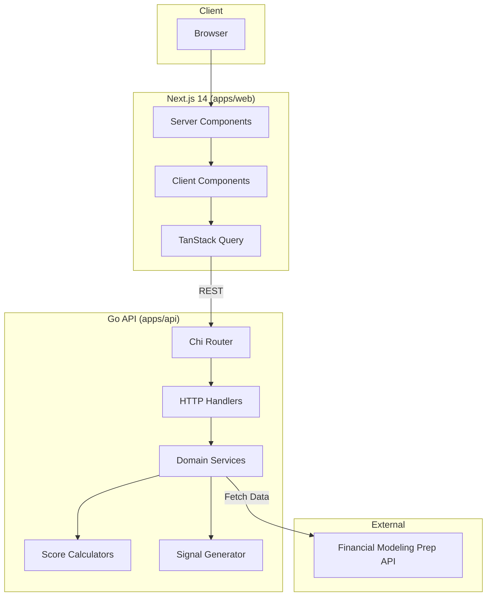
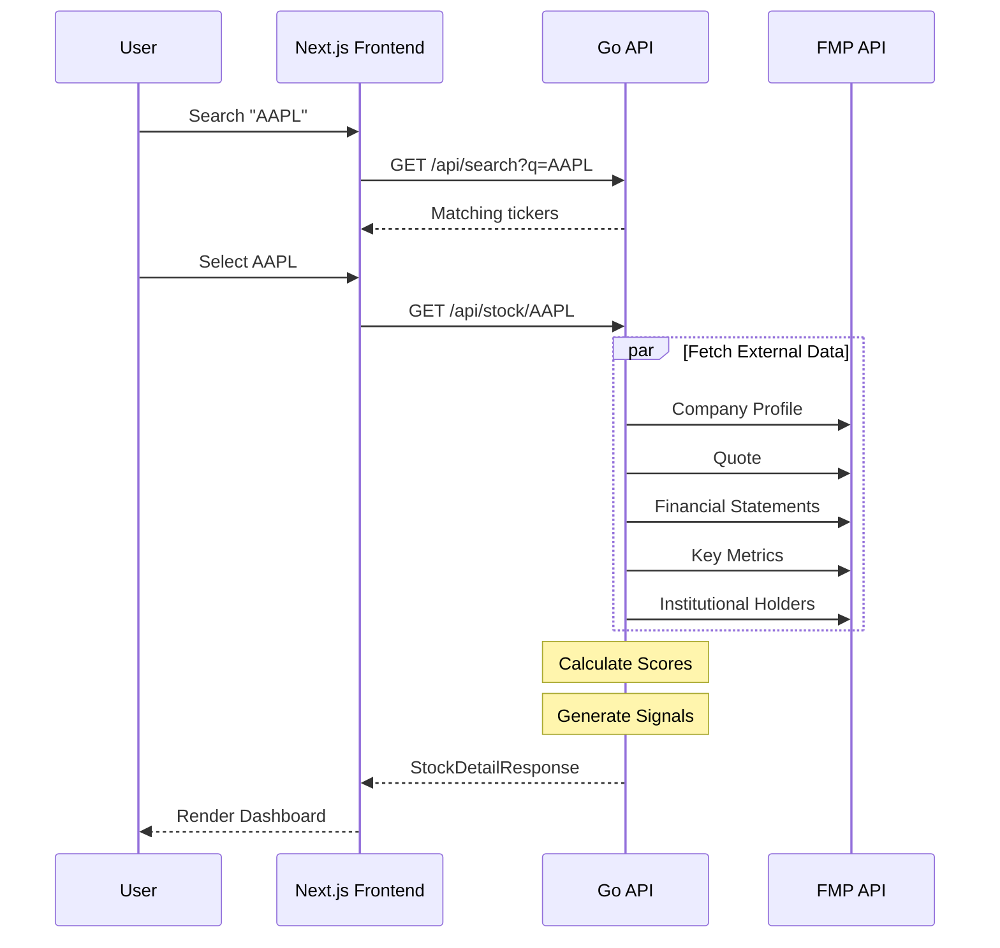
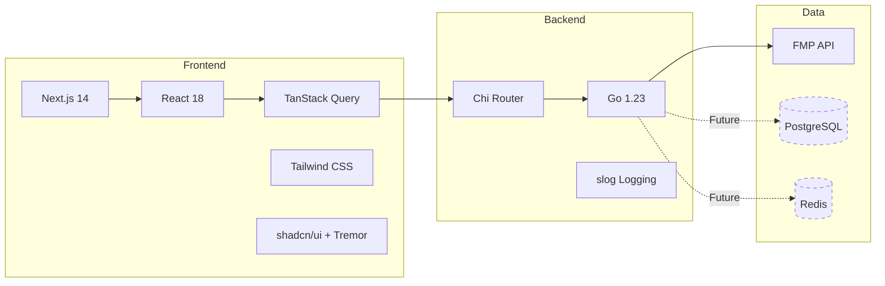
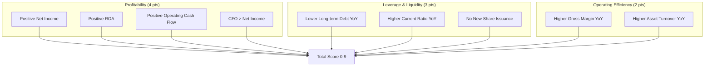
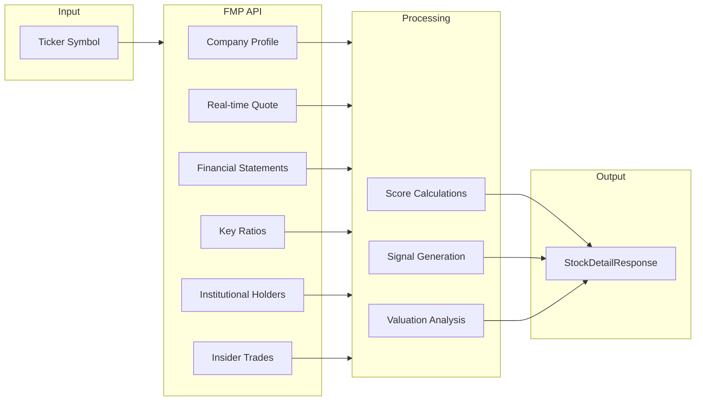

# Recon

**Stock fundamental analysis, distilled.** Enter a ticker, get the crux in 30 seconds.

Recon synthesizes financial data into three conviction scores and actionable signals—cutting through noise to surface what matters for investment decisions.

## Features

| Category | What You Get |
|----------|--------------|
| **Financial Health Scores** | Piotroski F-Score (0-9), Rule of 40, Altman Z-Score, DCF Valuation |
| **Performance** | 1D, 1W, 1M, YTD, 1Y returns with 52-week range visualization |
| **Valuation** | P/E, Forward P/E, PEG, EV/EBITDA, P/FCF, P/B—all with sector percentiles |
| **Financials** | Revenue growth, margins (gross/operating/net/FCF), ROE, ROIC, leverage |
| **Smart Money** | Institutional ownership trends, insider buy/sell activity (90-day) |
| **Signals** | Automated bullish/bearish/warning flags based on score thresholds |

## Architecture



## Request Flow



## Tech Stack



| Layer | Technology | Purpose |
|-------|------------|---------|
| Frontend | Next.js 14, React 18 | App Router, Server/Client Components |
| State | TanStack Query | Server state, caching, refetching |
| Styling | Tailwind CSS, shadcn/ui, Tremor | Utility CSS, components, charts |
| Backend | Go 1.23, Chi | HTTP routing, middleware |
| Data | Financial Modeling Prep | Real-time quotes, financials, filings |
| Types | TypeScript (shared) | API contract definitions |

## API Reference

### Endpoints

| Method | Endpoint | Description |
|--------|----------|-------------|
| `GET` | `/health` | Service health check |
| `GET` | `/api/stock/{ticker}` | Complete stock analysis |
| `GET` | `/api/search?q={query}` | Ticker symbol search |

### GET /health

Returns service status for monitoring.

```json
{
  "status": "ok",
  "timestamp": "2024-01-15T12:00:00Z",
  "version": "1.0.0"
}
```

### GET /api/stock/{ticker}

Returns comprehensive stock analysis including scores, signals, and financials.

**Path Parameters:**
- `ticker` (required): Stock symbol (1-5 uppercase letters, e.g., `AAPL`)

**Response:** `200 OK`

```json
{
  "company": {
    "ticker": "AAPL",
    "name": "Apple Inc.",
    "exchange": "NASDAQ",
    "sector": "Technology",
    "industry": "Consumer Electronics"
  },
  "quote": {
    "price": 192.53,
    "change": 2.15,
    "changePercent": 1.13,
    "volume": 48500000,
    "marketCap": 2950000000000,
    "fiftyTwoWeekHigh": 214.04,
    "fiftyTwoWeekLow": 164.08,
    "asOf": "2024-01-15T16:00:00Z"
  },
  "performance": {
    "day1Change": 1.13,
    "week1Change": 3.45,
    "month1Change": 8.92,
    "ytdChange": 5.12,
    "year1Change": 28.45,
    "percentOf52WeekHigh": 89.9
  },
  "scores": {
    "piotroski": {
      "score": 8,
      "breakdown": {
        "positiveNetIncome": true,
        "positiveROA": true,
        "positiveOperatingCashFlow": true,
        "cashFlowGreaterThanNetIncome": true,
        "lowerLongTermDebt": true,
        "higherCurrentRatio": true,
        "noNewShares": true,
        "higherGrossMargin": true,
        "higherAssetTurnover": false
      }
    },
    "ruleOf40": {
      "score": 42.5,
      "revenueGrowthPercent": 12.5,
      "profitMarginPercent": 30.0,
      "passed": true
    },
    "altmanZ": {
      "score": 2.95,
      "zone": "safe",
      "components": { ... }
    },
    "dcfValuation": {
      "intrinsicValue": 215.50,
      "currentPrice": 192.53,
      "differencePercent": 11.9,
      "assessment": "Fairly Valued"
    }
  },
  "signals": [
    {
      "type": "bullish",
      "category": "fundamental",
      "message": "Strong Piotroski score of 8/9",
      "priority": 1
    }
  ],
  "valuation": {
    "pe": { "value": 28.5, "sectorMedian": 25.2, "percentile": 65 },
    "forwardPe": { "value": 24.1, "sectorMedian": 22.8, "percentile": 58 },
    "peg": { "value": 1.8, "sectorMedian": 2.1, "percentile": 42 },
    "evToEbitda": { "value": 22.3, "sectorMedian": 18.5, "percentile": 72 },
    "priceToFcf": { "value": 25.8, "sectorMedian": 22.1, "percentile": 68 },
    "priceToBook": { "value": 45.2, "sectorMedian": 8.5, "percentile": 95 }
  },
  "holdings": {
    "topInstitutional": [ ... ],
    "totalInstitutionalOwnership": 0.72,
    "netChangeShares": 15000000,
    "netChangeQuarters": 3
  },
  "insiderTrades": [ ... ],
  "insiderActivity": {
    "buyCount90d": 5,
    "sellCount90d": 12,
    "netValue90d": -2500000
  },
  "financials": {
    "revenueGrowthYoY": 0.08,
    "grossMargin": 0.44,
    "operatingMargin": 0.30,
    "netMargin": 0.25,
    "fcfMargin": 0.28,
    "roe": 1.47,
    "roic": 0.56,
    "debtToEquity": 1.81,
    "currentRatio": 0.99,
    "interestCoverage": 29.5
  },
  "meta": {
    "fundamentalsAsOf": "2024",
    "holdingsAsOf": "2024-Q3",
    "priceAsOf": "2024-01-15T16:00:00Z",
    "generatedAt": "2024-01-15T16:05:23Z"
  }
}
```

**Error Responses:**

| Status | Code | Description |
|--------|------|-------------|
| `400` | `INVALID_TICKER` | Ticker format invalid (must be 1-5 letters) |
| `404` | `TICKER_NOT_FOUND` | Ticker not found in data source |
| `500` | `INTERNAL_ERROR` | Server error |

### GET /api/search

Search for ticker symbols by company name or ticker.

**Query Parameters:**
- `q` (required): Search query (min 1 character)
- `limit` (optional): Max results (default: 10, max: 50)

**Response:** `200 OK`

```json
{
  "query": "apple",
  "results": [
    {
      "ticker": "AAPL",
      "name": "Apple Inc.",
      "exchange": "NASDAQ",
      "sector": "Technology"
    },
    {
      "ticker": "APLE",
      "name": "Apple Hospitality REIT Inc.",
      "exchange": "NYSE",
      "sector": "Real Estate"
    }
  ]
}
```

## Scoring Systems

### Piotroski F-Score (0-9)

Value investing score measuring financial strength across 9 binary criteria:



| Score | Interpretation |
|-------|----------------|
| 8-9 | Strong fundamentals |
| 5-7 | Average |
| 0-4 | Weak fundamentals |

### Rule of 40

Growth + profitability balance for evaluating companies:

```
Score = Revenue Growth % + Profit Margin %
```

| Score | Interpretation |
|-------|----------------|
| 40+ | Healthy balance |
| 30-39 | Acceptable |
| <30 | Needs improvement |

### Altman Z-Score

Bankruptcy prediction model:

| Zone | Score | Risk Level |
|------|-------|------------|
| Safe | > 2.99 | Low bankruptcy risk |
| Gray | 1.81 - 2.99 | Uncertain |
| Distress | < 1.81 | High bankruptcy risk |

## Project Structure

```
recon/
├── apps/
│   ├── api/                      # Go backend
│   │   ├── cmd/api/              # Entry point
│   │   └── internal/
│   │       ├── api/              # Router, handlers, middleware
│   │       ├── domain/           # Business logic
│   │       │   ├── stock/        # Stock service & types
│   │       │   ├── scores/       # Score calculations
│   │       │   ├── signals/      # Signal generation
│   │       │   └── search/       # Search service
│   │       └── infrastructure/   # External integrations
│   │           └── external/fmp/ # FMP API client
│   │
│   └── web/                      # Next.js frontend
│       └── src/
│           ├── app/              # App Router pages
│           ├── components/       # React components
│           │   ├── dashboard/    # Stock dashboard sections
│           │   ├── search/       # Ticker search
│           │   └── ui/           # Base UI components
│           ├── hooks/            # TanStack Query hooks
│           └── lib/              # API client, utilities
│
├── packages/
│   └── shared/                   # TypeScript API contracts
│       └── src/
│           ├── stock.ts          # Stock response types
│           └── search.ts         # Search response types
│
└── docs/
    ├── architecture.md           # Architecture deep dive
    └── api-spec.md               # Full API specification
```

## Local Development

### Prerequisites

- Node.js 20+
- Go 1.22+
- pnpm
- [FMP API key](https://financialmodelingprep.com/developer/docs/) (free tier available)

### Quick Start

```bash
# Clone repository
git clone https://github.com/drewjst/recon.git
cd recon

# Install frontend dependencies
pnpm install

# Configure API environment
cp apps/api/.env.example apps/api/.env
# Edit apps/api/.env and add your FMP_API_KEY

# Configure frontend environment
cp apps/web/.env.example apps/web/.env.local

# Start the API (terminal 1)
cd apps/api
go run ./cmd/api

# Start the frontend (terminal 2)
cd apps/web
pnpm dev
```

**Access the app:**
- Frontend: http://localhost:3000
- API: http://localhost:8080

### Environment Variables

**Backend (`apps/api/.env`):**

| Variable | Required | Default | Description |
|----------|----------|---------|-------------|
| `FMP_API_KEY` | Yes | - | Financial Modeling Prep API key |
| `PORT` | No | `8080` | Server port |
| `ENV` | No | `development` | Environment (development/production) |

**Frontend (`apps/web/.env.local`):**

| Variable | Required | Default | Description |
|----------|----------|---------|-------------|
| `NEXT_PUBLIC_API_URL` | No | `http://localhost:8080` | Backend API URL |

### Running Tests

```bash
# Backend tests
cd apps/api
go test ./...

# Frontend tests
cd apps/web
pnpm test
```

### Building for Production

```bash
# Build API binary
cd apps/api
go build -o api ./cmd/api

# Build frontend
cd apps/web
pnpm build
```

## Data Flow



## Contributing

See [CLAUDE.md](./CLAUDE.md) for coding standards, conventions, and guidelines.

### Git Workflow

This repository requires **linear history**. All PRs must be rebased before merging.

```bash
# Before pushing your PR, rebase on main
git fetch origin
git rebase origin/main

# If you have conflicts, resolve them and continue
git rebase --continue

# Force push your rebased branch
git push --force-with-lease
```

### Key Principles

- **Readability over cleverness** - Code should be self-documenting
- **Functions do one thing** - Max 20-30 lines, single responsibility
- **Explicit error handling** - Never swallow errors silently
- **Type safety** - No `any` types in TypeScript
- **Test alongside implementation** - Not after

## License

MIT
